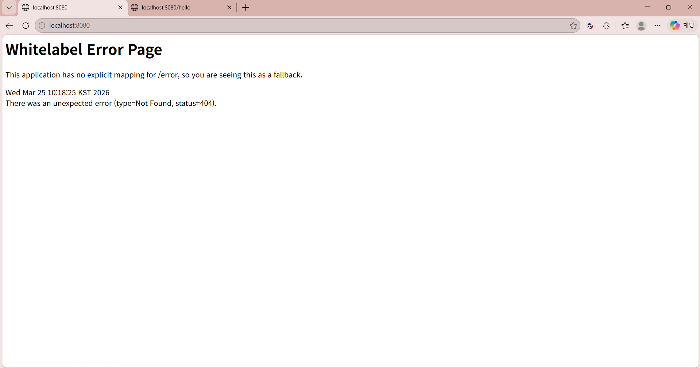

## 1주차 학습한 내용
## 이번 스터디에서는 웹이라는게 어떻게 작동하고 정확히 무엇인지, http나 프론트엔드 백엔드에 대한 개념을 학습하였다. URL 이라는 것은 웹 상에서 자원의 위치를 나타내는 주소이고 URL 의 구조에 대해 배워볼 수 있었다. 그리고 프론트엔드는 사용자가 직접 보고 상호작용하는 UI라면 백엔드는 사용자의 요청을 처리하고 데이터를 관리하는 것이라는 각각의 개념과 역할도 학습할 수 있었다. 이전에는 웹, 프론트엔드, 백엔드의 개념에 대해 추상적이고 피상적으로만 알고 있었다면, 이번 스터디를 통해서 정확한 웹의 개념과 웹의 작동원리, 각각의 역할에 대해 조금 더 자세하고 깊게 알 수 있게 되었다. 

## 상품기능 API 설계하기 
## 1. 상품 정보 등록: HTTP Method: POST, URI: /products
## 2. 상품 목록 조회: HTTP Method: GET, URI: /products
## 3. 개별 상품 정보 상세 조회: HTTP Method: GET, URI: /products/{productsId}
## 4. 상품 정보 수정: HTTP Method: PATCH, URI: /products/{productsID}
## 5. 상품 삭제: HTTP Method: DELETE, URI: /products/{productsId}

## 주문기능 API 설계하기
## 1. 주문 정보 생성: HTTP Method: POST, URI: /order
## 2. 주문 목록 조회: HTTP Method: GET, URI: /order
## 3. 개별 주문 정보 상세 조회: HTTP Method: GET, URI: /order/{orderId}
## 4. 주문 취소: HTTP Method: DELETE, URI: /order/{orderId}

